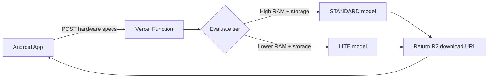

# Memo Backend

**A lightweight model-resolution service for the [Memo](https://github.com/Majid460/memo-cache-android) Android library.**

This service receives a device's hardware profile (RAM, available storage) and returns the most appropriate on-device LLM model for that device — along with its public download URL. It exists to demonstrate how a Memo-integrating app can offer hardware-aware, tiered model selection instead of shipping a single fixed model size to every device.

---

## Why This Exists

Not every Android device can comfortably run the same on-device model. A high-end phone with 8GB RAM can handle a larger, higher-quality quantized model; a budget device with 3GB RAM needs something smaller just to avoid crashing or thrashing storage.

Rather than hardcoding one model size into an app, this service lets a client send its hardware specs and receive back the right model for its capability tier — with the actual model files hosted separately on Cloudflare R2.

This repo is the **reference backend** used by Memo's demo app. It is not required to use the Memo library — Memo ships with its own sensible default model and lets any developer point to their own backend (or none at all) via the library's `Builder` configuration.

---

## How It Works



1. The client (Memo's `HardwareProfiler`) collects `totalRamMb` and `availableStorageMb` from the device.
2. It sends these as a POST request to `/api/resolve-model`.
3. The function evaluates the specs against simple tier thresholds.
4. It responds with the matching model's metadata and a direct, public download URL hosted on Cloudflare R2.

---

## API Reference

### `POST /api/resolve-model`

**Request body:**
```json
{
  "totalRamMb": 8000,
  "availableStorageMb": 3000
}
```

**Response:**
```json
{
  "tier": "STANDARD",
  "modelName": "gemma-1b-standard",
  "fileName": "gemma-1b-standard.task",
  "sizeMb": 1050,
  "downloadUrl": "https://pub-xxxxxxxx.r2.dev/gemma-1b-standard.task"
}
```

**Tier logic:**

| Tier | Requirements |
|---|---|
| `STANDARD` | RAM ≥ 6000MB **and** available storage ≥ 2000MB |
| `LITE` | All other cases (fallback default) |

**Error responses:**

| Status | Cause |
|---|---|
| `405` | Request method is not `POST` |
| `400` | Missing or invalid `totalRamMb` / `availableStorageMb` fields |
| `500` | Server misconfigured (missing `R2_BASE_URL` environment variable) |

---

## Local Development

```bash
git clone https://github.com/Majid460/memo-backend.git
cd memo-backend
npm install
cp .env.example .env
```

Fill in `.env` with your own R2 bucket's public URL:
```
R2_BASE_URL=https://your-bucket.r2.dev
```

Run locally with the Vercel CLI:
```bash
npm install -g vercel
vercel dev
```

Test it:
```bash
curl -X POST http://localhost:3000/api/resolve-model \
  -H "Content-Type: application/json" \
  -d '{"totalRamMb": 8000, "availableStorageMb": 3000}'
```

---

## Deployment

This service is deployed on [Vercel](https://vercel.com).

```bash
vercel
```

Environment variables must be set in the Vercel dashboard (Project Settings → Environment Variables) — `.env` is not committed and is not read automatically in production:

| Variable | Description |
|---|---|
| `R2_BASE_URL` | Public base URL of your Cloudflare R2 bucket hosting the model files |

---

## Project Structure

```
memo-backend/
├── api/
│   └── resolve-model.ts    Tier-resolution endpoint
├── .env.example             Template for required environment variables
├── vercel.json               Vercel function configuration
└── README.md
```

---

## Status

🚧 Reference implementation for the Memo demo app.

- [x] Hardware-based tier resolution (LITE / STANDARD)
- [x] Environment-based R2 configuration
- [ ] Additional model tiers
- [ ] Request validation hardening / rate limiting

---

## Related

- **[Memo](https://github.com/Majid460/memo-cache-android)** — the Android library this backend supports.

## License

MIT